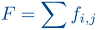
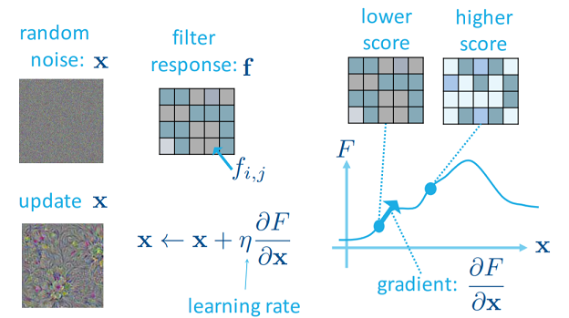

# HW4: Explainable AI
## I. Task
Using the following techniques and some toolkits to **observe** and **explain** the CNN classification model trained in HW3
 * Plot **Saliency Maps**
 * Visualize **Convolution Filters**
 * Find 'Pros' and 'Cons' with **LIME Image Explainer**
 
## II. Saliency Maps
 * Drawn with the help of `keras-vis` module
 * **Goal**: Find out which pixels affect the classification scores the most when altered slightly
 * Mathematical explanation: 
     - Given image **_I0_** and classification score **_Sc_** of class **_c_**, compute:  
     - 
     - using **_Guided Backpropagation_**
 
## III. Convolution Filters
 * **Goal**: Use **_Gradient Ascent_** to obtain the input picture that produces highest level of activation for a filter 
 * Mathematical explanation:
     - _Level of Activation_: 
     - 
     - 64 Iterations, starting with image of random noise:
     - 
     - applied **_L2 Normalization_** when computing gradients
 
## IV. LIME Image Explainer
 * **LIME**: _Local Interpretable Model-Agnostic Explanations_ 
 * Slice the image into some(~100) _super-pixels_ with the help of `scikit-image`
 * Feed the CNN with batches of images comprising of different combinations of the _super-pixels_
 * **Goal**: Find **_Pros_**/**_Cons_** of the image  
     - _super-pixels_ that _**positively/negatively**_ affect classification scores the most
     - displayed in _**Green/Red**_ patches on top of the image
 
## V. References
 * Deep Inside Convolutional Networks: Visualising Image Classification Models and Saliency Maps
     - https://arxiv.org/pdf/1312.6034.pdf
 * Gradient Ascent for Filter Visualization
     - _page 78~79_, https://www.csie.ntu.edu.tw/~yvchen/f105-adl/doc/161103_ConvolutionalNN.pdf 
 * Implementation for Generating Filter Visualization
     - https://medium.com/@jon.froiland/convolutional-neural-networks-part-8-3ac54c9478cc
 * Guidelines to Using LIME Image Explainer
     - https://github.com/marcotcr/lime/blob/master/doc/notebooks/Tutorial%20-%20Faces%20and%20GradBoost.ipynb
