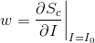

# HW4: Explainable AI
## I. Task
Using the following techniques and some toolkits to **observe** and **explain** the CNN classification model trained in HW3
 * Plot **Saliency Maps**
 * Visualize **Convolution Filters**
 * Find 'Pros' and 'Cons' with **LIME Image Explainer**
 
## II. Saliency Maps
 * Drawn with the help of `keras-vis` module
 * **Goal**: Find out which pixels affect the classification scores the most when altered slightly
 * Mathematical explanation: 
     - Given image **_I0_** and classification score **_Sc_** of class **_c_**, compute:  
     - 
     - using **_Guided Backpropagation_**
 
## III. Result
**Error Measure: Categorical Accuracy**  
> Kaggle in-class competition results   
>  
**Model 1--Hand-crafted Logistic Regression w/ adagrad optimizer \[added "age_squared" and "education yrs"\]**
 * Public score: 85.552 % 
 * Private score: 85.468 %
    
**Model 2--Scikit-learn Linear SVC w/ C=20.0 \[used same features as in Model 1\]**
 * Public score: 85.577 % 
 * Private score: 85.456 %
   
**Model 3--Scikit-learn Gradient Boosting Classifier w/ depth=6, 250 estimators \[applied parameter tuning\]**
 * Public score: 87.383 % 
 * Private score: 87.485 % _(Final Rank: Top 15%, **24/165**)_
